<div align="center">

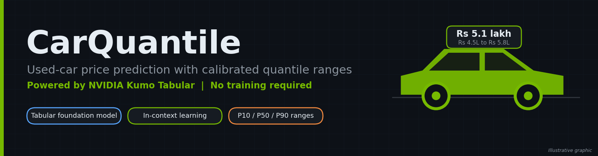

# CarQuantile

**Used-car price prediction with calibrated quantile ranges, powered by NVIDIA Kumo Tabular. No model training required.**

[](https://www.python.org/)
[](https://pytorch.org/)
[](https://streamlit.io/)
[](https://huggingface.co/nvidia/Kumo-Tabular)
[](https://xgboost.ai/)
[](#-testing)
[](#-license)

[Overview](#-overview) · [Demo](#-app-preview) · [How it works](#-how-it-works) · [Setup](#-setup-windows) · [Results](#-results) · [Testing](#-testing) · [Limitations](#-limitations)

</div>

---

## 📌 Overview

CarQuantile predicts the resale price of a used car as a **median estimate plus an 80% range** (10th to 90th percentile):

> **₹5.1 lakh**, likely between **₹4.5 and ₹5.8 lakh**

It uses [NVIDIA Kumo Tabular](https://huggingface.co/nvidia/Kumo-Tabular), an open tabular foundation model. You give it a table of labeled rows (the *context*) and new rows to score (the *query*), and it returns predictions in **one forward pass**, with no training, tuning or feature engineering. For regression it outputs 999 quantiles, which gives both a point estimate and an uncertainty range.

| What we measure | How |
|---|---|
| **Accuracy** | MAE, RMSE and R² vs an XGBoost baseline |
| **Calibration** | Range coverage: how often the real price lands inside the 10th to 90th percentile range (target about 80%) |
| **Speed** | Time per prediction and peak GPU memory |

**Measured result:** the untrained model beats the trained baseline — MAE **₹106,489** vs ₹116,397 (−8.5%), coverage **81.4%** vs the 80% target, ~1.4 ms per car. Full numbers in [Results](#-results).

> **Built on a pretrained model.** This project is an application and evaluation built on Kumo Tabular. It does not train or modify the model.

**Status:** ✅ Phase 1 (data, model, baseline) · ✅ Phase 2 (Streamlit app) · ✅ Phase 3 (fixes, benchmarks, evaluation, tests — all numbers below are measured, not guessed) · ✅ More features (city, insurance status, service history)

---

## ✨ Features

- 🎯 Price estimate with an 80% range instead of a single number
- 🏙️ **10 features per car**: the original 7 plus city, insurance status and service history (derived from real columns — [how](#derived-features-city-insurance-status-service-history))
- 🖥️ Streamlit app with dropdowns and sliders, no code needed
- ➕ "Add a new sale" button: the model adapts without retraining
- ⚡ Model and context loaded once and cached (~0.07 s per click after warm-up)
- 🛡️ Friendly handling of bad input, unseen brands and GPU problems (no tracebacks on screen — details go to `logs/app.log`)
- 📊 Built-in XGBoost comparison, coverage check, benchmark script and 26 pytest tests

---

## 🖼️ App Preview

> The images in this section are **illustrative mockups with sample values**. Replace them with real screenshots of your app (same file names) once it runs.

### Input screen

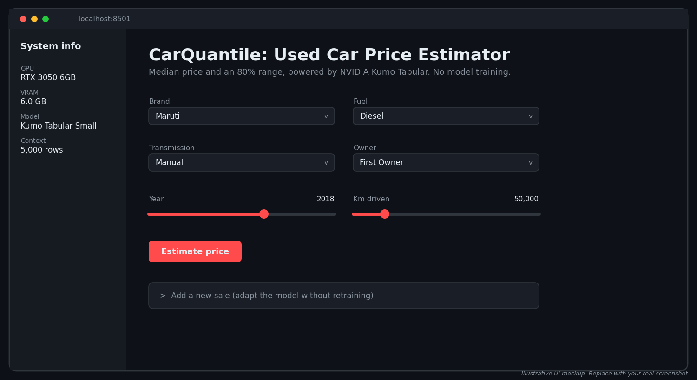

### Prediction result

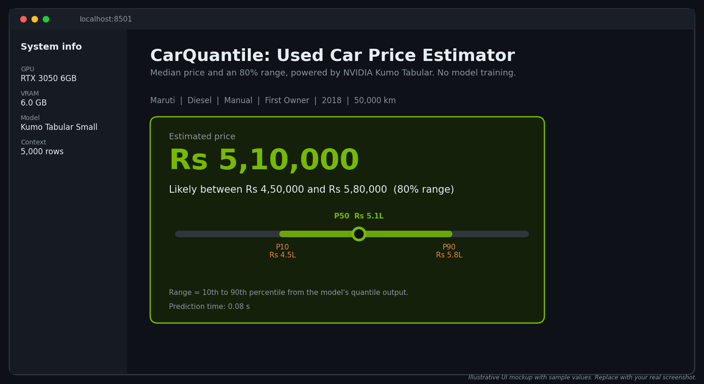

---

## 🧠 How It Works

### Architecture

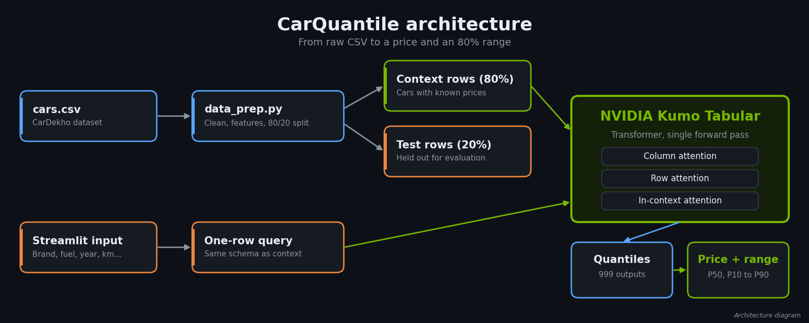

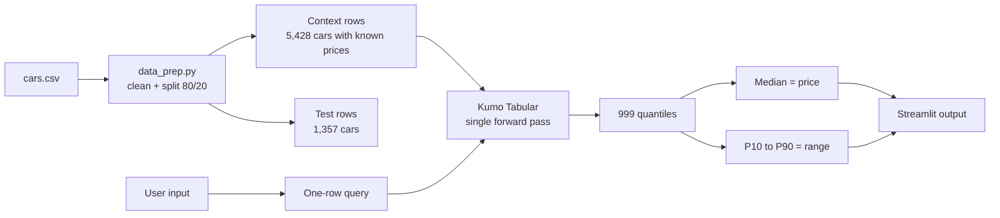

1. The labeled cars (context) are loaded onto the GPU once.
2. A new car becomes a one-row query (a batch of rows also works).
3. Kumo Tabular reads the context and query together and returns 999 quantiles (`q001`…`q999`) in one forward pass.
4. The 50th percentile is the price; the 10th and 90th percentiles form the range. Predictions are made on `log(price)` and converted back to rupees.

### Derived features: city, insurance status, service history

The raw CarDekho file has **no** location, insurance or service columns, so `src/data_prep.py::derive_features` adds all three with **deterministic rules that never look at the price** (no target leakage; CRC32 instead of random numbers, so the values are identical on every run and platform). If `data/cars.csv` ever provides one of the columns itself, that value is used as-is and the rule for it is skipped.

| Feature | Rule | Values |
|---|---|---|
| `city` | CRC32 of `name\|year\|km_driven` picks from a 12-city pool; the four biggest metros are listed twice so the mix resembles the real used-car market | Delhi, Mumbai, Bangalore, Hyderabad, Chennai, Pune, Kolkata, Ahmedabad, Jaipur, Lucknow, Surat, Chandigarh |
| `insurance_status` | from `year`: ≥ 2018 → comprehensive cover, 2012–2017 → third-party, older → lapsed | Comprehensive, Third Party, Expired |
| `service_history` | from `owner` + `km_driven`: first owner ≤ 100,000 km → Full; first/second owner ≤ 200,000 km → Partial; otherwise Not Recorded | Full, Partial, Not Recorded |

They are honestly labelled **derived, not measured**. `insurance_status` and `service_history` re-encode real columns (`year`, `owner`, `km_driven`) in listing language; `city` carries no price signal at all — but because its hash includes the car's full `name`, it does separate models that share a brand (Swift vs Alto). Distribution on the 6,785 clean rows: city 12 values (Mumbai 864 → Chandigarh 380), insurance 3,901 Third Party / 1,909 Expired / 975 Comprehensive, service history 3,495 Full / 2,513 Partial / 777 Not Recorded. All three appear as dropdowns in the app and are context columns the model reads like any other feature.

### In-context learning

Instead of training a model for every dataset, the pretrained model reads labeled examples and predicts new rows directly, much like giving an LLM examples in a prompt.

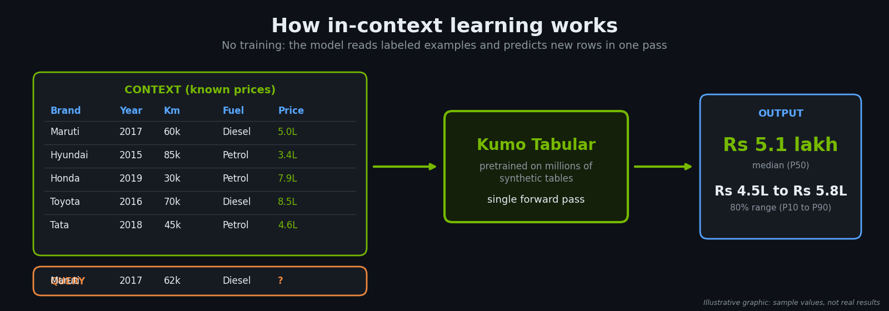

According to the model announcement, Kumo Tabular is a Transformer with three kinds of attention:

| Attention | What it learns |
|---|---|
| **Column** | What a value means within its column (is 60,000 km typical or extreme?) |
| **Row** | How features interact inside one car (year, km, brand together) |
| **In-context** | How query rows relate to labeled context rows |

It was pretrained only on **artificial tables** generated from random causal graphs, so it has never seen real car data.

### Quantile output

The regression head outputs 999 quantiles. The 50th percentile is the price, and the 10th and 90th percentiles form the range.

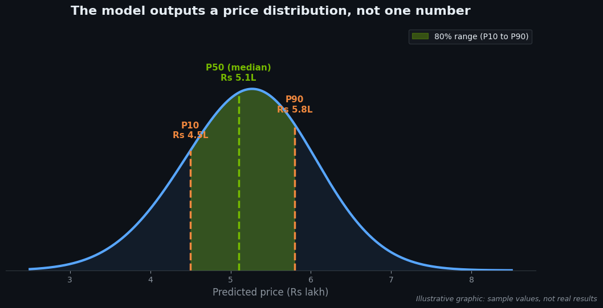

### Coverage (calibration)

If the range is well calibrated, about 80% of real prices should fall inside the 10th to 90th percentile range. Far below 80% means overconfident ranges. Far above means ranges that are too wide. Ours measures **81.4%** on the full test set.

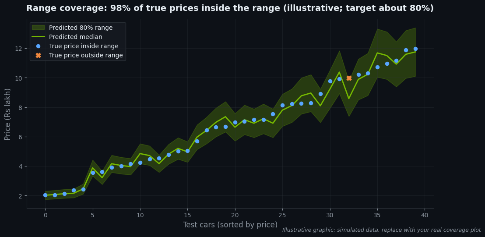

---

## 📁 Project Structure

```
carquantile/
├── app.py                 # Streamlit UI (form, result, add/reset context)
├── src/
│   ├── data_prep.py       # load, clean, derive city/insurance/service, split
│   ├── model.py           # load Kumo Tabular, validate input, predict + range
│   ├── baseline.py        # XGBoost baseline
│   ├── evaluate.py        # metrics, coverage, speed -> results/comparison.csv
│   ├── benchmark.py       # context-size / model-size benchmark -> results/
│   ├── applog.py          # writes tracebacks to logs/app.log (UI stays clean)
│   ├── run_demo.py        # CLI demo: 5 cars vs. true prices
│   ├── formatting.py      # Indian-rupee formatting (lakh / crore)
│   └── gpu_check.py       # CUDA / GPU / VRAM verification
├── scripts/
│   ├── smoke_test.py      # 200-row synthetic end-to-end model check
│   └── run_ui_tests.py    # manual UI cases -> results/ui_tests.md
├── tests/
│   └── test_basic.py      # 26 pytest tests (GPU ones skip without CUDA)
├── data/
│   └── cars.csv           # CarDekho dataset (8,128 rows, you download this)
├── docs/images/           # images used in this README + evaluation charts
├── results/
│   ├── comparison.csv     # Kumo vs XGBoost on the 20% test set
│   ├── benchmark.csv      # every (context size, model size) setting
│   ├── benchmark.png      # the same benchmark as a chart
│   ├── ui_tests.md        # manual UI test table with real outputs
│   └── baseline.json      # XGBoost metrics (python -m src.baseline)
├── logs/app.log           # app tracebacks (created on first error)
├── requirements.txt
├── NOTES.md               # verified API notes + measured numbers
└── README.md
```

---

## ⚙️ Setup (Windows)

**Tested target:** Windows 11 laptop, NVIDIA RTX 3050 6 GB, 16 GB RAM, **Python 3.13** (the `sdm` library requires Python ≥ 3.11; 3.13 has the best CUDA wheel coverage on Windows).

### 1. Check the NVIDIA driver

```bash
nvidia-smi
```

You should see your RTX 3050 in the table.

### 2. Create a virtual environment

```bash
py -3.13 -m venv .venv
source .venv/Scripts/activate        # Git Bash
# .venv\Scripts\activate             # cmd / PowerShell
python -m pip install --upgrade pip
```

### 3. Install PyTorch with CUDA

Windows wheels come from PyTorch's own index (PyPI ships CPU-only builds):

```bash
pip install torch --index-url https://download.pytorch.org/whl/cu128
```

Verify:

```bash
python -m src.gpu_check
```

Expected: `torch.cuda.is_available() : True`, `NVIDIA GeForce RTX 3050 6GB Laptop GPU`, about `6 GiB`.

### 4. Install the Kumo Tabular library

```bash
pip install git+https://github.com/NVIDIA/structured-data-models.git
```

The library runs natively on Windows — its optional Triton kernels fall back to pure PyTorch, so **WSL2 is not required**. (If you prefer WSL2 anyway, see the notes at the end of `NOTES.md`.)

### 5. Install the project packages

```bash
pip install -r requirements.txt
```

> ⚠️ **Managed-PC note:** this machine's Windows Application Control policy (WDAC / Smart App Control) blocks the native DLLs of brand-new wheels. `requirements.txt` therefore pins `pyarrow==24.0.0` and `scikit-learn==1.7.2`; `src/model.py` also imports torch before pandas to avoid a `c10.dll` conflict. Details and symptoms: `NOTES.md` §6.

### 6. Get the dataset

Download the CarDekho used-car dataset from Kaggle ([vehicle-dataset-from-cardekho](https://www.kaggle.com/datasets/nehalbirla/vehicle-dataset-from-cardekho)), take **`Car details v3.csv`** and save it as `data/cars.csv`. (In this repo it is already in place, fetched from a public mirror of that exact file.)

That file has no city / insurance / service columns, so they are [derived](#derived-features-city-insurance-status-service-history). If you ever supply a richer export that *does* contain `city`, `insurance_status` or `service_history`, those columns are used as-is and the matching derivation is skipped automatically.

The model weights (`nvidia/Kumo-Tabular`, revision `v1.0.0`) download automatically from the Hugging Face Hub on first use — about 65 s once, then cached in `~/.cache/huggingface`.

---

## ▶️ Run

```bash
streamlit run app.py
```

Open <http://localhost:8501>, choose the car details — ten inputs: brand, year, km driven, fuel, seller type, transmission, owner, **city, insurance status, service history** — click **Estimate price**, and read the price and range. Use **Add a new sale** to append a real sale to the context and predict again — no retraining. The sidebar shows the GPU name, model size and context size.

Other commands:

```bash
python -m src.run_demo       # CLI demo: 5 cars vs. true prices
python -m src.evaluate       # accuracy, coverage and speed vs XGBoost -> results/
python -m src.benchmark      # context size and model size benchmark -> results/
python scripts/run_ui_tests.py   # manual UI cases -> results/ui_tests.md
pytest -q                    # automated tests
```

The model and the encoded context are loaded **once** per process and reused: the first click includes a one-off CUDA warm-up (~1.0 s), every later click takes ~0.07–0.10 s (measured in `results/ui_tests.md`, section D).

---

## 📊 Results

Dataset: 8,128 raw rows → **6,785 clean** (duplicates, NaNs, invalid rows and 1st–99th-percentile price outliers removed), split **5,428 context / 1,357 test** with `random_state=42`. The same split is used for both models and for every benchmark setting, so the numbers below are directly comparable. Source: `results/comparison.csv` and `results/benchmark.csv` (written by `python -m src.evaluate` / `python -m src.benchmark`).

### 🏆 Key findings

- **Accuracy:** untrained Kumo Tabular (Small) beats the trained XGBoost baseline — MAE ₹106,489 vs ₹116,397 (−8.5%), RMSE ₹167,012 vs ₹182,721, R² 0.763 vs 0.716.
- **Coverage:** 81.4% of the 1,357 test prices fall inside [P10, P90] (target ~80%); the average range width is ₹3,47,610.
- **Speed:** ~1.4 ms per car (1.86 s for the whole test set) once the context is encoded; the encode itself is a one-off 0.19 s, and the first click also pays a ~1 s CUDA warm-up.
- **Best setting:** Small model + all 5,428 context rows — MAE ₹107,534 in the benchmark, ~1.1 ms/row, 0.564 GB peak VRAM. Medium edges it by ₹1,014 (0.9%, inside the ~1% run-to-run noise) at **3× the per-row time** and **22% more VRAM**, so Small stays the default in `src/model.py` and is used by `app.py` and `evaluate.py`.
- **Main limitation:** cars above ~₹15 lakh are systematically under-estimated (visible in `docs/images/pred_vs_actual.png`).

### Accuracy and speed (full 1,357-row test set)

| Model | MAE | RMSE | R² | Time per prediction | Peak VRAM |
|---|---|---|---|---|---|
| **Kumo Tabular** (Small, in-context, default) | **₹106,489** | **₹167,012** | **0.763** | 1.37 ms/row (1.864 s total) | 0.564 GB |
| XGBoost baseline (trained) | ₹116,397 | ₹182,721 | 0.716 | 0.015 ms/row (0.020 s total) | — |

XGBoost is **~90× faster per row** (it is a small tree ensemble) but less accurate on every metric. Both are honest numbers from `python -m src.evaluate`; Kumo's first prediction after start-up additionally costs ~1 s of CUDA warm-up.

### Range coverage (10th to 90th percentile)

| Range | Target | Observed | Average width |
|---|---|---|---|
| Kumo Tabular, Small + all context | ~80% | **81.4%** (1,105 of 1,357) | ₹3,47,610 |

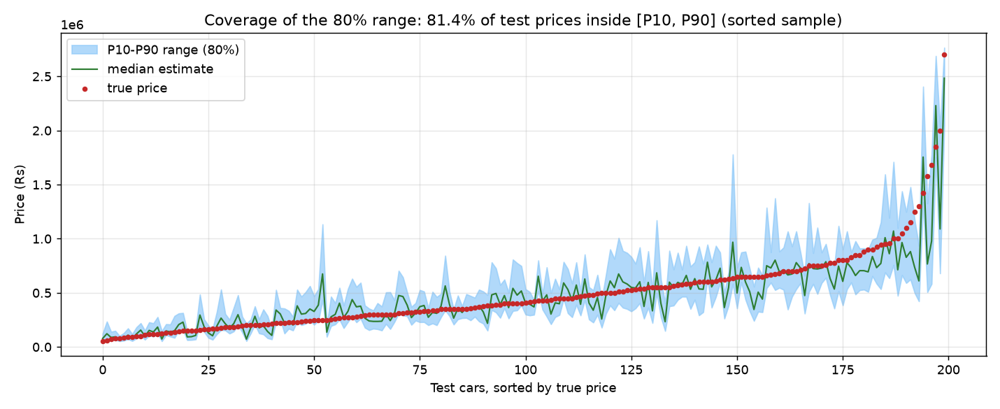

(The earlier 85.5% figure was a Phase-1 estimate on a 200-car sample; 81.4% is the measured value on the full test set.) XGBoost produces no quantiles, so it has no range to measure.

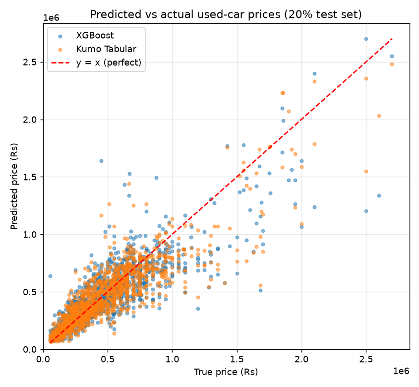

### Context size / model size benchmark

`python -m src.benchmark` → `results/benchmark.csv`, chart in `results/benchmark.png` (copy in `docs/images/benchmark.png`):

| Model size | Context rows | MAE | Coverage | ms / row | Peak VRAM | Encode |
|---|---|---|---|---|---|---|
| small | 2,000 | ₹112,375 | 80.8% | 1.17 | 0.288 GB | 1.02 s |
| small | 5,000 | ₹108,030 | 80.8% | 1.24 | 0.527 GB | 0.19 s |
| **small** | **all (5,428)** | **₹107,534** | **80.9%** | **1.08** | **0.564 GB** | **0.19 s** |
| medium | 2,000 | ₹112,451 | 80.5% | 1.05 | 0.558 GB | 0.24 s |
| medium | 5,000 | ₹107,796 | 81.0% | 2.22 | 0.683 GB | 0.62 s |
| medium | all (5,428) | ₹106,520 | 80.6% | 3.26 | 0.689 GB | 0.73 s |

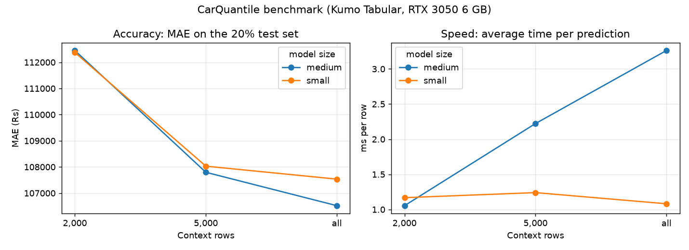

All 6 settings finished with `status=ok` — **no out-of-memory error** on the 6 GB card (medium peaked at 0.689 GB).

**Why Small + all rows is the default:** accuracy keeps improving as the context grows — MAE ₹112,375 → ₹108,030 → ₹107,534 from 2,000 to 5,428 rows — while the per-row time stays ~1.1 ms, because the context is encoded once (a 0.19 s one-off) and reused, so a bigger context does not slow the click down. The Medium model buys nothing measurable: at the full context it is **3× slower** (3.26 vs 1.08 ms/row) and uses **22% more VRAM** (0.689 vs 0.564 GB), while its MAE advantage of ₹1,014 (0.9%) is inside the run-to-run noise — in the previous run of this same benchmark it was ₹823 *worse*, so the ordering flips between runs. So `DEFAULT_MODEL_SIZE="small"` and `DEFAULT_CONTEXT_ROWS=None` (use all rows) stay the defaults in `src/model.py`.

Honesty note: re-running the same setting moves MAE by up to ~1% and per-row time by up to ~25% (CUDA kernels are not bit-exact) — e.g. the small/all setting measured ₹107,534 in this benchmark and ₹106,489 in the evaluation run above. Differences that small are noise, so Medium being ₹76 *worse* at 2,000 rows but ₹1,014 *better* at 5,428 rows means the same thing: **no measurable accuracy gain, at up to 3× the cost.**

**Known issue:** expensive cars (above ~₹15 lakh) are still under-estimated (see `docs/images/pred_vs_actual.png`). Numbers are reported honestly, even where XGBoost wins — it is ~90× faster per row.

---

## 🧪 Testing

```bash
pytest -q          # -> 26 passed (on this machine: data + CUDA present)
```

The tests check that:

- cleaned data has the expected columns and **no missing values** (fake and real dataset)
- the three derived features (city, insurance status, service history) are **deterministic**, follow their documented rules, stay inside their value domains, and **never override a real column** the CSV provides itself
- invalid rows (NaNs, bad years, negative prices, duplicates) are dropped
- the 80/20 split is reproducible (`random_state=42`)
- `predict()` returns `low <= price <= high` and never a negative price
- an unseen brand does not crash (it only produces a warning)
- invalid input (missing column, missing value, non-numeric year, negative km) fails with a **clear plain-language message**
- "add a new sale" grows the context by exactly 1 row and "reset" restores it
- `predict_batch()` keeps row order and the ordered range

Tests that need `data/cars.csv` or a CUDA GPU skip with an explicit reason (`needs data/cars.csv (the dataset is not in place)` / `needs a CUDA GPU (torch.cuda.is_available() is False)`), so `pytest` stays usable on a clean checkout.

### Manual UI test cases

`python scripts/run_ui_tests.py` runs the app itself through Streamlit's AppTest and writes **`results/ui_tests.md`** — 12 widget cases (very old car, maximum km, rare brand `ashok`, min/max slider positions, CNG, luxury automatic, city/insurance/service-history combinations, …), 4 cases the dropdowns cannot express (unseen brand, negative km, missing field, year 1850 / 900,000 km), plus the two failure paths and the add/reset context check. Highlights:

| Check | Result |
|---|---|
| 12 widget cases | 12/12 estimates, no exception, no error banner, always `low ≤ price ≤ high` |
| Unseen brand | predicts + warns *"…is not a known brand in the training data…"* |
| Negative km | rejected: *"Km driven cannot be negative (got -500)."* |
| Missing field | rejected: *"Missing value for ['fuel']…"* |
| No CUDA device | friendly error, app stops, **no traceback** |
| CUDA out of memory | friendly error, details in `logs/app.log`, second click works |
| Add / Reset context | 5,428 → 5,429 → 5,428 rows |

Screenshots I still need to capture manually for `docs/images/`:

1. `app_form.png` — the empty form with the sidebar (fresh page load)
2. `app_result.png` — a completed estimate with the range bar
3. `app_warning.png` — an extreme/unseen input showing the yellow warning
4. `app_add_sale.png` — "Add to context" success message showing 5,429 rows
5. `app_no_cuda.png` — the red "CUDA required" error (needs the CPU-only torch wheel, or just say it is reproduced by `results/ui_tests.md` section C1)

---

## 🔧 Troubleshooting

| Problem | Fix |
|---|---|
| `torch.cuda.is_available()` is `False` | You likely installed the CPU-only wheel. Reinstall with `pip install torch --index-url https://download.pytorch.org/whl/cu128` |
| `DLL load failed ... Application Control policy has blocked this file` | Your PC's WDAC / Smart App Control is blocking a brand-new wheel. Use the pins in `requirements.txt` (`pyarrow==24.0.0`, `scikit-learn==1.7.2`) or disable Smart App Control |
| `WinError 1114` loading `c10.dll` | Import torch **before** pandas/pyarrow (`src/model.py` already does), and keep the version pins above |
| HF symlink warning on Windows | Harmless; weights still cache. Silence with `HF_HUB_DISABLE_SYMLINKS_WARNING=1` |
| CUDA out of memory | The app frees the GPU cache and retries with a smaller batch / smaller context, then tells you what it changed; check `logs/app.log` for the traceback |
| App shows an error | The screen only shows a plain sentence; the full traceback is in `logs/app.log` |
| Slow predictions | First call includes CUDA warm-up (~1.0 s); later calls are ~0.07–0.10 s. Plug in the charger / use performance mode |

---

## ⚠️ Limitations

- Kumo Tabular supports only **numerical and categorical** columns; text and timestamps must be turned into features first (we derive `brand` from the car name, keep `year` as a number, and turn the absent location/insurance/service fields into three categorical features — see [Derived features](#derived-features-city-insurance-status-service-history)).
- **City, insurance status and service history are derived, not measured.** The raw CarDekho file contains none of them, so they are built from `name`, `year`, `owner` and `km_driven` by fixed rules that never see the price. They are useful, realistic listing fields — but they are not evidence about where a car was sold or how it was serviced. Supplying real columns in `data/cars.csv` replaces the derivations automatically.
- It needs an **NVIDIA GPU** — CPU inference is extremely slow, and the app stops with a clear message when CUDA is missing.
- **Expensive cars are under-estimated:** above ~₹15 lakh the predictions sit below the y = x line (see `docs/images/pred_vs_actual.png`). Likely the log-target transform interacting with the quantile output — still open.
- Accuracy may degrade if new cars differ a lot from the context data (unseen brands, price ranges the context never contained). Unseen values are accepted with a warning, not silently trusted.
- Predictions depend on the context table; changing the context changes the estimate. Always validate on held-out data.
- The features use 8 of the raw dataset's 13 columns plus the 3 derived ones, so different raw cars can still look identical afterwards: **11 rows are exact duplicates across the 10 features + price**, 902 rows share an identical feature vector with another row, and **158 feature combinations appear in both the context and the test set** (before the derived features these numbers were 89 / 1,729 / 414 — `city`'s hash of the full car name separates models that share a brand). Both models see the same split, so the comparison is fair, but absolute accuracy is slightly optimistic.
- Prices reflect the dataset's time period and market — estimates, not valuations for a transaction.
- The 10th–90th percentile range should cover ~80% of true prices; coverage is reported as measured (**81.4%** on the full test set), not assumed.

---

## 🗺️ Roadmap

- [x] Phase 1 — data pipeline, model wrapper, smoke test, XGBoost baseline
- [x] Phase 2 — Streamlit app with cached context and "Add a new sale"
- [x] Phase 3 — input/GPU hardening, batch prediction, benchmarks, evaluation, coverage, tests, UI test table
- [x] Add more features (city, insurance status, service history)
- [ ] Compare against LightGBM and CatBoost
- [ ] Feature-importance view
- [ ] Fix the high-price under-estimation (log-target vs quantiles)
- [ ] Deployed demo (GPU hosting or saved predictions)

---

## 🙏 Acknowledgements and trademarks

- [NVIDIA Kumo Tabular](https://huggingface.co/nvidia/Kumo-Tabular) and the [structured-data-models](https://github.com/NVIDIA/structured-data-models) library
- [CarDekho dataset](https://www.kaggle.com/datasets/nehalbirla/vehicle-dataset-from-cardekho) on Kaggle
- Streamlit, PyTorch, XGBoost and scikit-learn

NVIDIA and the NVIDIA logo are trademarks of NVIDIA Corporation. This is an independent project and is not affiliated with or endorsed by NVIDIA. The graphics in `docs/images/` are original illustrations and do not include the NVIDIA logo.

## 📄 License

Project code is released under the MIT License (see `LICENSE`). Kumo Tabular is released by NVIDIA under the OpenMDW License Agreement, version 1.1 — check its terms for your use case.
