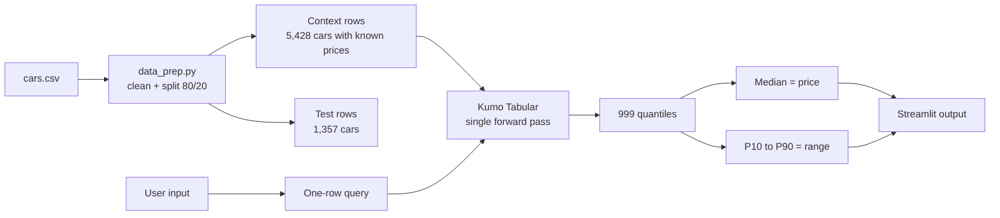

<div align="center">

# 🚗 CarSage

**Used-car price prediction with calibrated quantile ranges, powered by NVIDIA Kumo Tabular. No training required.**


</div>

---

## 📌 Overview

CarSage predicts the resale price of a used car as a **median estimate plus an
80% quantile range** (10th to 90th percentile), for example:

> **₹5.1 lakh**, likely between **₹4.5 and ₹5.8 lakh**

It uses [NVIDIA Kumo Tabular](https://huggingface.co/nvidia/Kumo-Tabular), a
tabular foundation model. Given a table of labeled rows (the *context*) and new
rows to score (the *query*), it returns predictions in a **single forward
pass**, with no training, tuning, or feature engineering. For regression it
outputs 999 quantiles, which gives both a point estimate and an uncertainty
range.

The project measures:

- **Accuracy:** MAE, RMSE and R² against an XGBoost baseline
- **Calibration:** range coverage — how often the real price falls inside the
  predicted 10th–90th percentile range (target about 80%)
- **Speed:** time per prediction

**Status:** ✅ Phase 1 complete (data, model, baseline — verified on the real
dataset) · 🚧 Phase 2 in progress (Streamlit app) · ⏳ Phase 3 (evaluation and
benchmarks)

---

## ✨ Features

- 🎯 Price estimate with an 80% range, not just a single number
- 🖥️ Streamlit web app with dropdowns and sliders, no code needed *(Phase 2)*
- ➕ "Add a new sale" button: the model adapts without retraining *(Phase 2)*
- ⚡ Model and context loaded once and cached for fast clicks
- 🛡️ Friendly handling of bad input, unseen brands and GPU problems
- 📊 Built-in comparison with XGBoost and a coverage check

---

## 🧠 How It Works



1. The labeled cars (context) are loaded onto the GPU once.
2. A new car becomes a one-row query (a batch of rows also works).
3. Kumo Tabular reads the context and query together and returns 999 quantiles
   (`q001`…`q999`) in one forward pass.
4. The 50th percentile is the price; the 10th and 90th percentiles form the
   range. Predictions are made on `log(price)` and converted back to rupees.

---

## 📁 Project Structure

```
CarSage/
├── app.py                 # Streamlit UI (Phase 2)
├── src/
│   ├── data_prep.py       # load, clean, split 80/20
│   ├── model.py           # load Kumo Tabular, predict price + range
│   ├── baseline.py        # XGBoost baseline
│   ├── evaluate.py        # metrics, coverage, speed -> results/
│   ├── run_demo.py        # CLI demo: 5 cars vs. true prices
│   ├── formatting.py      # Indian-rupee formatting (lakh / crore)
│   └── gpu_check.py       # CUDA / GPU / VRAM verification
├── scripts/
│   └── smoke_test.py      # 200-row synthetic end-to-end model check
├── tests/
│   └── test_basic.py      # 9 pytest tests
├── data/
│   └── cars.csv           # CarDekho dataset (8,128 rows, in place)
├── results/
│   └── baseline.json      # XGBoost metrics (comparison.csv comes in Phase 3)
├── requirements.txt
├── NOTES.md               # verified API notes + measured numbers
└── README.md
```

---

## ⚙️ Setup (Windows)

**Tested target:** Windows 11 laptop, NVIDIA RTX 3050 6 GB, 16 GB RAM,
**Python 3.13** (the `sdm` library requires Python ≥ 3.11; 3.13 has the best
CUDA wheel coverage on Windows).

### 1. Check your NVIDIA driver

```bash
nvidia-smi
```

You should see your RTX 3050 in the table.

### 2. Create a virtual environment

```bash
py -3.13 -m venv .venv
source .venv/Scripts/activate        # Git Bash
# .venv\Scripts\activate             # cmd / PowerShell
python -m pip install --upgrade pip
```

### 3. Install PyTorch with CUDA

Windows wheels come from PyTorch's own index (PyPI ships CPU-only builds):

```bash
pip install torch --index-url https://download.pytorch.org/whl/cu128
```

Verify:

```bash
python -m src.gpu_check
```

Expected: `torch.cuda.is_available() : True`,
`NVIDIA GeForce RTX 3050 6GB Laptop GPU`, about `6 GiB`.

### 4. Install the Kumo Tabular library

```bash
pip install git+https://github.com/NVIDIA/structured-data-models.git
```

The library runs natively on Windows — its optional Triton kernels fall back
to pure PyTorch, so **WSL2 is not required**. (If you prefer WSL2 anyway, see
the notes at the end of `NOTES.md`.)

### 5. Install the project packages

```bash
pip install -r requirements.txt
```

> ⚠️ **Managed-PC note:** this machine's Windows Application Control policy
> (WDAC / Smart App Control) blocks the native DLLs of brand-new wheels.
> `requirements.txt` therefore pins `pyarrow==24.0.0` and
> `scikit-learn==1.7.2`; `src/model.py` also imports torch before pandas to
> avoid a `c10.dll` conflict. Details and symptoms: `NOTES.md` §6.

### 6. Get the dataset

Download the CarDekho used-car dataset from Kaggle
([vehicle-dataset-from-cardekho](https://www.kaggle.com/datasets/nehalbirla/vehicle-dataset-from-cardekho)),
take **`Car details v3.csv`** and save it as `data/cars.csv`.
(In this repo it is already in place, fetched from a public mirror of that
exact file.)

The model weights (`nvidia/Kumo-Tabular`, revision `v1.0.0`) download
automatically from the Hugging Face Hub on first use — about 65 s once, then
cached in `~/.cache/huggingface`.

---

## ▶️ Usage

### CLI demo (works today)

```bash
python -m src.run_demo
```

### Web app (Phase 2)

```bash
streamlit run app.py
```

Then: pick **brand, fuel, transmission, owner** → set **year** and **km
driven** → **Estimate price** → read the price and its likely range. The
sidebar shows the GPU name, model size and context size, and **Add a new
sale** appends a labeled row to the context so the next prediction uses it —
no retraining.

---

## 📊 Results

Dataset: 8,128 raw rows → **6,785 clean** (duplicates, NaNs, invalid rows and
1st–99th-percentile price outliers removed), split **5,428 context / 1,357
test** with `random_state=42`. The Kumo columns marked \* come from the Phase 1
check on a 200-car sample of the test set; the full 1,357-row evaluation is
Phase 3 (`python -m src.evaluate`).

### Accuracy and speed

| Model | MAE | RMSE | R² | Time per prediction |
|---|---|---|---|---|
| Kumo Tabular (Small, in-context) | **≈ ₹88,328**\* | _TBD_ | _TBD_ | ≈ 0.26 s / batch (1–200 rows) |
| XGBoost baseline (trained) | ₹116,050 | ₹181,662 | 0.720 | 0.010 s / whole test set |

**Early read:** the *untrained* Kumo Tabular Small already beats the trained
XGBoost baseline on MAE, with honest interval coverage.

### Range coverage

| Range | Target | Observed |
|---|---|---|
| 10th to 90th percentile | ~80% | **85.5%**\* |

### Context size benchmark

| Context rows | MAE | Time |
|---|---|---|
| 2,000 | _TBD_ | _TBD_ |
| 5,000 | _TBD_ | _TBD_ |
| All | _TBD_ | _TBD_ |

**Known issue:** expensive cars (₹9 L+) are under-estimated, likely from the
log-target transform interacting with the quantile output — to be investigated
in Phase 3. Numbers are reported honestly, even where XGBoost wins.

---

## 🧪 Testing

```bash
pytest -q          # -> 9 passed
```

The tests check that:

- cleaned data has the expected columns and dtypes
- invalid rows (NaNs, bad years, negative prices, duplicates) are dropped
- the 80/20 split is reproducible (`random_state=42`)
- `predict()` returns `low <= price <= high`
- an unseen brand does not crash
- invalid input (missing columns, empty frame) fails with a clear message

Model tests run when `data/cars.csv` and a CUDA GPU are present, and skip
cleanly otherwise.

### Manual UI test cases

To be filled in Phase 2, once the app exists (10–15 cases including edge
cases: very old car, very high km, rare brand, GPU unavailable).

---

## 🔧 Troubleshooting

| Problem | Fix |
|---|---|
| `torch.cuda.is_available()` is `False` | You likely installed the CPU-only wheel. Reinstall with `pip install torch --index-url https://download.pytorch.org/whl/cu128` |
| `DLL load failed ... Application Control policy has blocked this file` | Your PC's WDAC / Smart App Control is blocking a brand-new wheel. Use the pins in `requirements.txt` (`pyarrow==24.0.0`, `scikit-learn==1.7.2`) or disable Smart App Control |
| `WinError 1114` loading `c10.dll` | Import torch **before** pandas/pyarrow (`src/model.py` already does), and keep the version pins above |
| HF symlink warning on Windows | Harmless; weights still cache. Silence with `HF_HUB_DISABLE_SYMLINKS_WARNING=1` |
| CUDA out of memory | Use the Small model, reduce context to 2,000–5,000 rows, predict in batches (already the defaults here) |
| Slow predictions | First call includes CUDA warm-up (~8 s); later calls are ~0.25 s. Plug in the charger / use performance mode |

---

## ⚠️ Limitations

- Kumo Tabular supports only **numerical and categorical** columns; text and
  timestamps must be turned into features first (we derive `brand` from the
  car name and keep `year` as a number).
- It needs an **NVIDIA GPU** — CPU inference is extremely slow.
- Accuracy may degrade if new cars differ a lot from the context data
  (unseen brands, price ranges the context never contained).
- Predictions depend on the context table; changing the context changes the
  estimate. Always validate on held-out data.
- Prices reflect the dataset's time period and market — estimates, not
  valuations for a transaction.
- The 10th–90th percentile range should cover ~80% of true prices; coverage is
  reported as measured (85.5% so far), not assumed.

---

## 🗺️ Roadmap

- [x] Phase 1 — data pipeline, model wrapper, smoke test, XGBoost baseline
- [ ] Phase 2 — Streamlit app with cached context and "Add a new sale"
- [ ] Phase 3 — full evaluation, coverage, context/model-size benchmarks
- [ ] Add more features (city, insurance status, service history)
- [ ] Compare against LightGBM and CatBoost
- [ ] Investigate high-price under-estimation (log-target vs quantiles)

---

## 🙏 Acknowledgements

- [NVIDIA Kumo Tabular](https://huggingface.co/nvidia/Kumo-Tabular) and the
  [structured-data-models](https://github.com/NVIDIA/structured-data-models) library
- [CarDekho dataset](https://www.kaggle.com/datasets/nehalbirla/vehicle-dataset-from-cardekho) on Kaggle
- Streamlit, PyTorch, XGBoost and scikit-learn

## 📄 License

This project is released under the MIT License (see `LICENSE`). Kumo Tabular
itself is released by NVIDIA under the OpenMDW License Agreement, version 1.1 —
check its terms for your use case.
