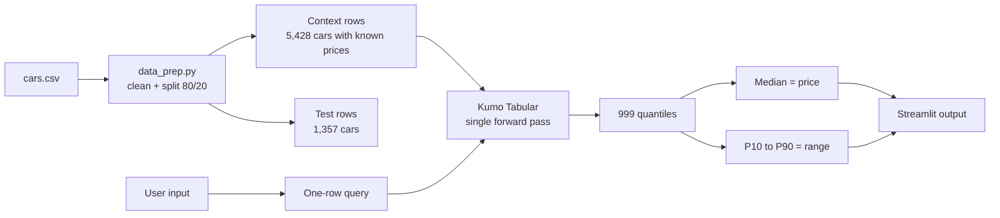

<div align="center">


# CarQuantile

**Used-car price prediction with calibrated quantile ranges, powered by NVIDIA Kumo Tabular. No model training required.**

[](https://www.python.org/)
[](https://pytorch.org/)
[](https://streamlit.io/)
[](https://huggingface.co/nvidia/Kumo-Tabular)
[](https://xgboost.ai/)
[](#-testing)
[](#-license)

[Overview](#-overview) · [Demo](#-app-preview) · [How it works](#-how-it-works) · [Setup](#-setup-windows) · [Results](#-results) · [Testing](#-testing) · [Limitations](#-limitations)

</div>

---

## 📌 Overview

CarQuantile predicts the resale price of a used car as a **median estimate plus an 80% range** (10th to 90th percentile):

> **₹5.1 lakh**, likely between **₹4.5 and ₹5.8 lakh**

It uses [NVIDIA Kumo Tabular](https://huggingface.co/nvidia/Kumo-Tabular), an open tabular foundation model. You give it a table of labeled rows (the *context*) and new rows to score (the *query*), and it returns predictions in **one forward pass**, with no training, tuning or feature engineering. For regression it outputs 999 quantiles, which gives both a point estimate and an uncertainty range.

| What we measure | How |
|---|---|
| **Accuracy** | MAE, RMSE and R² vs an XGBoost baseline |
| **Calibration** | Range coverage: how often the real price lands inside the 10th to 90th percentile range (target about 80%) |
| **Speed** | Time per prediction and peak GPU memory |

**Measured result:** the untrained model beats the trained baseline — MAE **₹107,066** vs ₹116,050 (−7.7%), coverage **81.1%** vs the 80% target, ~1 ms per car. Full numbers in [Results](#-results).

> **Built on a pretrained model.** This project is an application and evaluation built on Kumo Tabular. It does not train or modify the model.

**Status:** ✅ Phase 1 (data, model, baseline) · ✅ Phase 2 (Streamlit app) · ✅ Phase 3 (fixes, benchmarks, evaluation, tests — all numbers below are measured, not guessed)

---

## ✨ Features

- 🎯 Price estimate with an 80% range instead of a single number
- 🖥️ Streamlit app with dropdowns and sliders, no code needed
- ➕ "Add a new sale" button: the model adapts without retraining
- ⚡ Model and context loaded once and cached (~0.07 s per click after warm-up)
- 🛡️ Friendly handling of bad input, unseen brands and GPU problems (no tracebacks on screen — details go to `logs/app.log`)
- 📊 Built-in XGBoost comparison, coverage check, benchmark script and 20 pytest tests

---

## 🖼️ App Preview

> The images in this section are **illustrative mockups with sample values**. Replace them with real screenshots of your app (same file names) once it runs.

### Input screen


### Prediction result


---

## 🧠 How It Works

### Architecture




1. The labeled cars (context) are loaded onto the GPU once.
2. A new car becomes a one-row query (a batch of rows also works).
3. Kumo Tabular reads the context and query together and returns 999 quantiles (`q001`…`q999`) in one forward pass.
4. The 50th percentile is the price; the 10th and 90th percentiles form the range. Predictions are made on `log(price)` and converted back to rupees.

### In-context learning

Instead of training a model for every dataset, the pretrained model reads labeled examples and predicts new rows directly, much like giving an LLM examples in a prompt.


According to the model announcement, Kumo Tabular is a Transformer with three kinds of attention:

| Attention | What it learns |
|---|---|
| **Column** | What a value means within its column (is 60,000 km typical or extreme?) |
| **Row** | How features interact inside one car (year, km, brand together) |
| **In-context** | How query rows relate to labeled context rows |

It was pretrained only on **artificial tables** generated from random causal graphs, so it has never seen real car data.

### Quantile output

The regression head outputs 999 quantiles. The 50th percentile is the price, and the 10th and 90th percentiles form the range.


### Coverage (calibration)

If the range is well calibrated, about 80% of real prices should fall inside the 10th to 90th percentile range. Far below 80% means overconfident ranges. Far above means ranges that are too wide. Ours measures **81.1%** on the full test set.


---

## 📁 Project Structure

```
carquantile/
├── app.py                 # Streamlit UI (form, result, add/reset context)
├── src/
│   ├── data_prep.py       # load, clean, split 80/20
│   ├── model.py           # load Kumo Tabular, validate input, predict + range
│   ├── baseline.py        # XGBoost baseline
│   ├── evaluate.py        # metrics, coverage, speed -> results/comparison.csv
│   ├── benchmark.py       # context-size / model-size benchmark -> results/
│   ├── applog.py          # writes tracebacks to logs/app.log (UI stays clean)
│   ├── run_demo.py        # CLI demo: 5 cars vs. true prices
│   ├── formatting.py      # Indian-rupee formatting (lakh / crore)
│   └── gpu_check.py       # CUDA / GPU / VRAM verification
├── scripts/
│   ├── smoke_test.py      # 200-row synthetic end-to-end model check
│   └── run_ui_tests.py    # manual UI cases -> results/ui_tests.md
├── tests/
│   └── test_basic.py      # 20 pytest tests (GPU ones skip without CUDA)
├── data/
│   └── cars.csv           # CarDekho dataset (8,128 rows, you download this)
├── docs/images/           # images used in this README + evaluation charts
├── results/
│   ├── comparison.csv     # Kumo vs XGBoost on the 20% test set
│   ├── benchmark.csv      # every (context size, model size) setting
│   ├── benchmark.png      # the same benchmark as a chart
│   ├── ui_tests.md        # manual UI test table with real outputs
│   └── baseline.json      # XGBoost metrics from Phase 1
├── logs/app.log           # app tracebacks (created on first error)
├── requirements.txt
├── NOTES.md               # verified API notes + measured numbers
└── README.md
```

---

## ⚙️ Setup (Windows)

**Tested target:** Windows 11 laptop, NVIDIA RTX 3050 6 GB, 16 GB RAM, **Python 3.13** (the `sdm` library requires Python ≥ 3.11; 3.13 has the best CUDA wheel coverage on Windows).

### 1. Check the NVIDIA driver

```bash
nvidia-smi
```

You should see your RTX 3050 in the table.

### 2. Create a virtual environment

```bash
py -3.13 -m venv .venv
source .venv/Scripts/activate        # Git Bash
# .venv\Scripts\activate             # cmd / PowerShell
python -m pip install --upgrade pip
```

### 3. Install PyTorch with CUDA

Windows wheels come from PyTorch's own index (PyPI ships CPU-only builds):

```bash
pip install torch --index-url https://download.pytorch.org/whl/cu128
```

Verify:

```bash
python -m src.gpu_check
```

Expected: `torch.cuda.is_available() : True`, `NVIDIA GeForce RTX 3050 6GB Laptop GPU`, about `6 GiB`.

### 4. Install the Kumo Tabular library

```bash
pip install git+https://github.com/NVIDIA/structured-data-models.git
```

The library runs natively on Windows — its optional Triton kernels fall back to pure PyTorch, so **WSL2 is not required**. (If you prefer WSL2 anyway, see the notes at the end of `NOTES.md`.)

### 5. Install the project packages

```bash
pip install -r requirements.txt
```

> ⚠️ **Managed-PC note:** this machine's Windows Application Control policy (WDAC / Smart App Control) blocks the native DLLs of brand-new wheels. `requirements.txt` therefore pins `pyarrow==24.0.0` and `scikit-learn==1.7.2`; `src/model.py` also imports torch before pandas to avoid a `c10.dll` conflict. Details and symptoms: `NOTES.md` §6.

### 6. Get the dataset

Download the CarDekho used-car dataset from Kaggle ([vehicle-dataset-from-cardekho](https://www.kaggle.com/datasets/nehalbirla/vehicle-dataset-from-cardekho)), take **`Car details v3.csv`** and save it as `data/cars.csv`. (In this repo it is already in place, fetched from a public mirror of that exact file.)

The model weights (`nvidia/Kumo-Tabular`, revision `v1.0.0`) download automatically from the Hugging Face Hub on first use — about 65 s once, then cached in `~/.cache/huggingface`.

---

## ▶️ Run

```bash
streamlit run app.py
```

Open <http://localhost:8501>, choose the car details, click **Estimate price**, and read the price and range. Use **Add a new sale** to append a real sale to the context and predict again — no retraining. The sidebar shows the GPU name, model size and context size.

Other commands:

```bash
python -m src.run_demo       # CLI demo: 5 cars vs. true prices
python -m src.evaluate       # accuracy, coverage and speed vs XGBoost -> results/
python -m src.benchmark      # context size and model size benchmark -> results/
python scripts/run_ui_tests.py   # manual UI cases -> results/ui_tests.md
pytest -q                    # automated tests
```

The model and the encoded context are loaded **once** per process and reused: the first click includes a one-off CUDA warm-up (~0.85 s), every later click takes ~0.07 s (measured in `results/ui_tests.md`, section D).

---

## 📊 Results

Dataset: 8,128 raw rows → **6,785 clean** (duplicates, NaNs, invalid rows and 1st–99th-percentile price outliers removed), split **5,428 context / 1,357 test** with `random_state=42`. The same split is used for both models and for every benchmark setting, so the numbers below are directly comparable. Source: `results/comparison.csv` and `results/benchmark.csv` (written by `python -m src.evaluate` / `python -m src.benchmark`).

### 🏆 Key findings

- **Accuracy:** untrained Kumo Tabular (Small) beats the trained XGBoost baseline — MAE ₹107,066 vs ₹116,050 (−7.7%), RMSE ₹167,431 vs ₹181,662, R² 0.762 vs 0.720.
- **Coverage:** 81.1% of the 1,357 test prices fall inside [P10, P90] (target ~80%); the average range width is ₹3,48,225.
- **Speed:** ~1.0 ms per car (1.38 s for the whole test set) once the context is encoded; the encode itself is a one-off 0.17 s, and the first click also pays a ~0.85 s CUDA warm-up.
- **Best setting:** Small model + all 5,428 context rows — lowest MAE (₹106,569 in the benchmark), ~1 ms/row, 0.54 GB peak VRAM; this is the default in `src/model.py` and used by `app.py` and `evaluate.py`.
- **Main limitation:** cars above ~₹15 lakh are systematically under-estimated (visible in `docs/images/pred_vs_actual.png`).

### Accuracy and speed (full 1,357-row test set)

| Model | MAE | RMSE | R² | Time per prediction | Peak VRAM |
|---|---|---|---|---|---|
| **Kumo Tabular** (Small, in-context, default) | **₹107,066** | **₹167,431** | **0.762** | 1.01 ms/row (1.377 s total) | 0.541 GB |
| XGBoost baseline (trained) | ₹116,050 | ₹181,662 | 0.720 | 0.011 ms/row (0.015 s total) | — |

XGBoost is **~90× faster per row** (it is a small tree ensemble) but less accurate on every metric. Both are honest numbers from `python -m src.evaluate`; Kumo's first prediction after start-up additionally costs ~0.85 s of CUDA warm-up.

### Range coverage (10th to 90th percentile)

| Range | Target | Observed | Average width |
|---|---|---|---|
| Kumo Tabular, Small + all context | ~80% | **81.1%** (1,101 of 1,357) | ₹3,48,225 |


(The earlier 85.5% figure was a Phase-1 estimate on a 200-car sample; 81.1% is the measured value on the full test set.) XGBoost produces no quantiles, so it has no range to measure.


### Context size / model size benchmark

`python -m src.benchmark` → `results/benchmark.csv`, chart in `results/benchmark.png` (copy in `docs/images/benchmark.png`):

| Model size | Context rows | MAE | Coverage | ms / row | Peak VRAM | Encode |
|---|---|---|---|---|---|---|
| small | 2,000 | ₹112,349 | 80.5% | 0.93 | 0.280 GB | 0.78 s |
| small | 5,000 | ₹108,395 | 80.8% | 0.82 | 0.506 GB | 0.16 s |
| **small** | **all (5,428)** | **₹106,569** | **81.0%** | **1.06** | **0.539 GB** | **0.17 s** |
| medium | 2,000 | ₹112,593 | 80.0% | 1.20 | 0.489 GB | 0.29 s |
| medium | 5,000 | ₹107,504 | 81.4% | 2.02 | 0.670 GB | 0.43 s |
| medium | all (5,428) | ₹107,392 | 80.5% | 2.07 | 0.674 GB | 0.46 s |


All 6 settings finished with `status=ok` — **no out-of-memory error** on the 6 GB card (medium peaked at 0.674 GB).

**Why Small + all rows is the default:** accuracy keeps improving as the context grows — MAE ₹112,349 → ₹108,395 → ₹106,569 from 2,000 to 5,428 rows — while the per-row time stays ~1 ms, because the context is encoded once (a 0.17 s one-off) and reused, so a bigger context does not slow the click down. The Medium model buys nothing: at the full context it is **2× slower** (2.07 vs 1.06 ms/row) and uses **25% more VRAM**, while its MAE difference is inside the run-to-run noise. So `DEFAULT_MODEL_SIZE="small"` and `DEFAULT_CONTEXT_ROWS=None` (use all rows) stay the defaults in `src/model.py`.

Honesty note: re-running the same setting moves MAE by up to ~0.5% and per-row time by up to ~15% (CUDA kernels are not bit-exact) — e.g. the small/all setting measured ₹106,569 in this benchmark and ₹107,066 in the evaluation run above. Differences that small are noise, so Medium being ₹891 *better* at 5,000 rows but ₹823 *worse* at 5,428 rows means the same thing: **no measurable accuracy gain, at 2× the cost.**

**Known issue:** expensive cars (above ~₹15 lakh) are still under-estimated (see `docs/images/pred_vs_actual.png`). Numbers are reported honestly, even where XGBoost wins — it is ~90× faster per row.

---

## 🧪 Testing

```bash
pytest -q          # -> 20 passed (on this machine: data + CUDA present)
```

The tests check that:

- cleaned data has the expected columns and **no missing values** (fake and real dataset)
- invalid rows (NaNs, bad years, negative prices, duplicates) are dropped
- the 80/20 split is reproducible (`random_state=42`)
- `predict()` returns `low <= price <= high` and never a negative price
- an unseen brand does not crash (it only produces a warning)
- invalid input (missing column, missing value, non-numeric year, negative km) fails with a **clear plain-language message**
- "add a new sale" grows the context by exactly 1 row and "reset" restores it
- `predict_batch()` keeps row order and the ordered range

Tests that need `data/cars.csv` or a CUDA GPU skip with an explicit reason (`needs data/cars.csv (the dataset is not in place)` / `needs a CUDA GPU (torch.cuda.is_available() is False)`), so `pytest` stays usable on a clean checkout.

### Manual UI test cases

`python scripts/run_ui_tests.py` runs the app itself through Streamlit's AppTest and writes **`results/ui_tests.md`** — 12 widget cases (very old car, maximum km, rare brand `ashok`, min/max slider positions, CNG, luxury automatic, …), 4 cases the dropdowns cannot express (unseen brand, negative km, missing field, year 1850 / 900,000 km), plus the two failure paths and the add/reset context check. Highlights:

| Check | Result |
|---|---|
| 12 widget cases | 12/12 estimates, no exception, no error banner, always `low ≤ price ≤ high` |
| Unseen brand | predicts + warns *"…is not a known brand in the training data…"* |
| Negative km | rejected: *"Km driven cannot be negative (got -500)."* |
| Missing field | rejected: *"Missing value for ['fuel']…"* |
| No CUDA device | friendly error, app stops, **no traceback** |
| CUDA out of memory | friendly error, details in `logs/app.log`, second click works |
| Add / Reset context | 5,428 → 5,429 → 5,428 rows |

Screenshots I still need to capture manually for `docs/images/`:

1. `app_form.png` — the empty form with the sidebar (fresh page load)
2. `app_result.png` — a completed estimate with the range bar
3. `app_warning.png` — an extreme/unseen input showing the yellow warning
4. `app_add_sale.png` — "Add to context" success message showing 5,429 rows
5. `app_no_cuda.png` — the red "CUDA required" error (needs the CPU-only torch wheel, or just say it is reproduced by `results/ui_tests.md` section C1)

---

## 🔧 Troubleshooting

| Problem | Fix |
|---|---|
| `torch.cuda.is_available()` is `False` | You likely installed the CPU-only wheel. Reinstall with `pip install torch --index-url https://download.pytorch.org/whl/cu128` |
| `DLL load failed ... Application Control policy has blocked this file` | Your PC's WDAC / Smart App Control is blocking a brand-new wheel. Use the pins in `requirements.txt` (`pyarrow==24.0.0`, `scikit-learn==1.7.2`) or disable Smart App Control |
| `WinError 1114` loading `c10.dll` | Import torch **before** pandas/pyarrow (`src/model.py` already does), and keep the version pins above |
| HF symlink warning on Windows | Harmless; weights still cache. Silence with `HF_HUB_DISABLE_SYMLINKS_WARNING=1` |
| CUDA out of memory | The app frees the GPU cache and retries with a smaller batch / smaller context, then tells you what it changed; check `logs/app.log` for the traceback |
| App shows an error | The screen only shows a plain sentence; the full traceback is in `logs/app.log` |
| Slow predictions | First call includes CUDA warm-up (~0.85 s); later calls are ~0.07 s. Plug in the charger / use performance mode |

---

## ⚠️ Limitations

- Kumo Tabular supports only **numerical and categorical** columns; text and timestamps must be turned into features first (we derive `brand` from the car name and keep `year` as a number).
- It needs an **NVIDIA GPU** — CPU inference is extremely slow, and the app stops with a clear message when CUDA is missing.
- **Expensive cars are under-estimated:** above ~₹15 lakh the predictions sit below the y = x line (see `docs/images/pred_vs_actual.png`). Likely the log-target transform interacting with the quantile output — still open.
- Accuracy may degrade if new cars differ a lot from the context data (unseen brands, price ranges the context never contained). Unseen values are accepted with a warning, not silently trusted.
- Predictions depend on the context table; changing the context changes the estimate. Always validate on held-out data.
- The kept columns are only 8 of the raw dataset's 13, so different raw cars can look identical afterwards: **89 rows are exact duplicates in those 8 columns**, 1,729 rows share an identical feature vector with another row, and **414 feature combinations appear in both the context and the test set**. Both models see the same split, so the comparison is fair, but absolute accuracy is slightly optimistic.
- Prices reflect the dataset's time period and market — estimates, not valuations for a transaction.
- The 10th–90th percentile range should cover ~80% of true prices; coverage is reported as measured (**81.1%** on the full test set), not assumed.

---

## 🗺️ Roadmap

- [x] Phase 1 — data pipeline, model wrapper, smoke test, XGBoost baseline
- [x] Phase 2 — Streamlit app with cached context and "Add a new sale"
- [x] Phase 3 — input/GPU hardening, batch prediction, benchmarks, evaluation, coverage, tests, UI test table
- [ ] Add more features (city, insurance status, service history)
- [ ] Compare against LightGBM and CatBoost
- [ ] Feature-importance view
- [ ] Fix the high-price under-estimation (log-target vs quantiles)
- [ ] Deployed demo (GPU hosting or saved predictions)

---

## 🙏 Acknowledgements and trademarks

- [NVIDIA Kumo Tabular](https://huggingface.co/nvidia/Kumo-Tabular) and the [structured-data-models](https://github.com/NVIDIA/structured-data-models) library
- [CarDekho dataset](https://www.kaggle.com/datasets/nehalbirla/vehicle-dataset-from-cardekho) on Kaggle
- Streamlit, PyTorch, XGBoost and scikit-learn

NVIDIA and the NVIDIA logo are trademarks of NVIDIA Corporation. This is an independent project and is not affiliated with or endorsed by NVIDIA. The graphics in `docs/images/` are original illustrations and do not include the NVIDIA logo.

## 📄 License

Project code is released under the MIT License (see `LICENSE`). Kumo Tabular is released by NVIDIA under the OpenMDW License Agreement, version 1.1 — check its terms for your use case.
